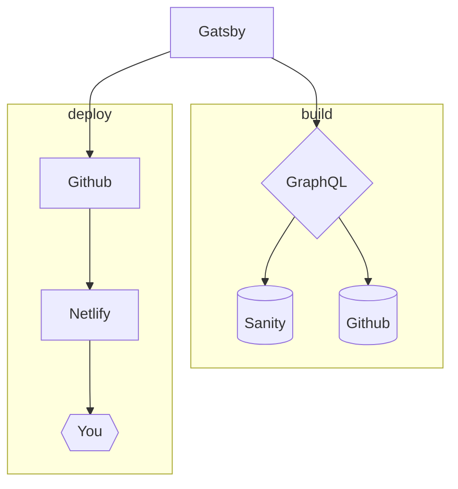
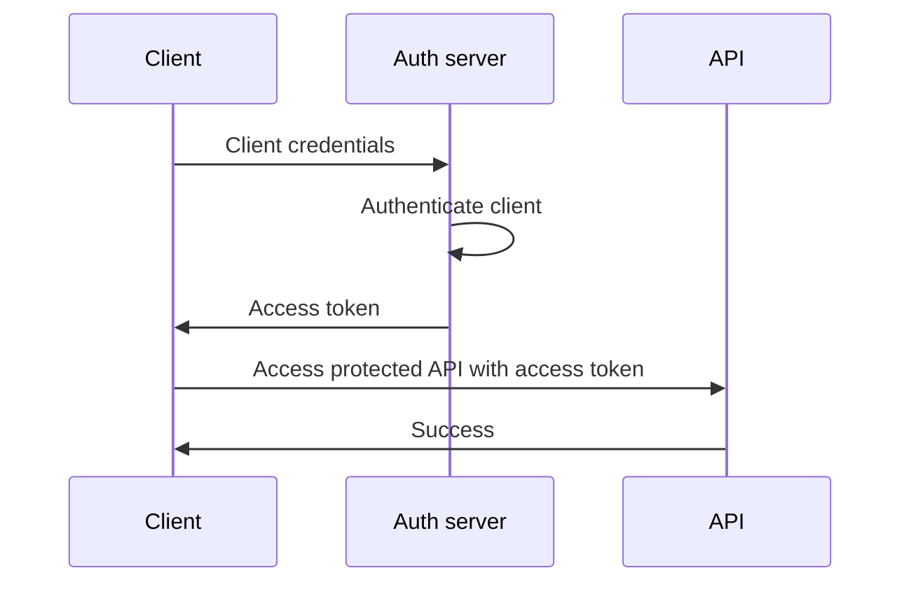

## 前言

之前陸續試了幾個能搭配 Markdown 產生網頁的 library，像是 [Hexo](https://hexo.io/zh-tw/) 或 [Gridsome](https://gridsome.org/)，但對於內容幾乎只是給自己看的雜記來說，用來總有種殺雞用牛刀的感覺，正好有些許關注的 Svelte 在 2020 年興起熱潮，就趁機換成了 [Sapper 的 blog template](https://github.com/Charca/sapper-blog-template) 來試試使用效果如何。

（追記：原本是先看到 [Routify 的 blog template](https://github.com/roxiness/routify-starter) 覺得很不錯，但 Routify 需要用到檔案路徑做 SPA，沒辦法 host 在 GitHub Pages 上，最後改用了以 [Sapper](https://sapper.svelte.dev/docs) 建構的 blog template。）

---

## Sapper Blog Template

### 安裝

```bash
npx degit Charca/sapper-blog-template your-blog-name
cd your-blog-name
npm install # or yarn!
npm run dev
```

- `npx` 是 npm 在 v5.2.0 之後內建的指令，提供暫時性執行某個 npm 套件的功能
- `degit` 是一套能供使用者直接取用現存 project 樣板的套件
  - 也可用 `npm i -g degit` 安裝後直接呼叫 `degit`

### What's inside it?

- [Svelte](https://svelte.dev/)
  - 一套秉持「Write less code」的精神，為了建構 UI 而生的 JavaScript 編譯器
  - 不採用 Virtual DOM diff，使用原生 JS 直接修改 DOM，擁有相對優秀的執行速度與檔案大小表現
- [Sapper](https://sapper.svelte.dev/)
  - 定位類似於 React 的 Next.js、Vue 的 Nuxt.js 的 framework 工具
  - 基於 Svelte 處理與補足了如 SSR、SPA、SSG 等應用製作的需求

### How does it work?

template 中的頁面相關檔案位於 `src/routes/blog`，主要功能由以下三個檔案實作：

- `_posts.js`：讀取和 parse markdown 檔案的 module
- `[slug].svelte`：文章頁面的 template
- `index.svelte`：文章列表的 template

文章檔案則放置於 `src/routes/blog/posts` 資料夾中，檔案名稱會 parse 成為網頁路徑，撰寫於文章開頭到 `<!-- more -->` 之間的內容會成為預覽部份，標題和日期記載在檔案內的 yaml 區域內

這邊我改寫了 `src/utils/markdown.js` 裡要丟到社群預覽的部份：

```javascript
// gray-matter 用於 parse yaml 區域部份的內容
const matter = require("gray-matter");
// ...
// 首個區塊為 yaml 資訊區，其餘部份為文章內容
const { data, content: rawContent } = matter(md);
// ...
// 判斷「閱讀更多」區域是否存在，若存在則取得位於其上方的內容
// 並存入預覽內容部份
if (rawContent.indexOf(EXCERPT_SEPARATOR) !== -1) {
  const splittedContent = rawContent.split(EXCERPT_SEPARATOR);
  excerpt = splittedContent[0];
  content = splittedContent[1];
} else {
  // 新增不存在時，改為取得 yaml 裡 summary 標籤的內容
  excerpt = data.summary;
}
// ...
```

### 更新版本

如果你用 `npm run update` 升級了相依套件，可能會跳出與 `rollup-plugin-svelte` 相關的編譯錯誤，網頁也會出現錯誤，這是因為相關記述方式有修改的關係：

- [sveltejs/rollup-plugin-svelte](https://github.com/sveltejs/rollup-plugin-svelte)

```diff
  client: {
    // ...
    plugins: [
      // ...
-       svelte({
-        dev,
-        hydratable: true,
-        emitCss: true,
-      }),
-      resolve(),

+      svelte({
+        emitCss: true,
+        compilerOptions: {
+          hydratable: true,
+        },
+      }),
+      resolve({ browser: true }),
    ]
    // ...
  }

  server: {
    // ...
    plugins: [
      // ...
-       svelte({
-         generate: 'ssr',
-         dev,
-       }),
-       resolve(),

+       svelte({
+         compilerOptions: {
+           generate: 'ssr',
+         },
+       }),
+       resolve({ browser: true }),
    ]
    // ...
  }
```

### Circular Dependencies

運行時會出現的 circular dependecies 警告，可以透過修改 `rollup.config.js` 裡的偵測部份解決：

- [Silence preload export warnings related to TypeScript support](https://github.com/sveltejs/sapper-template/pull/246/files)

```diff
- const onwarn = (warning, onwarn) =>
-   (warning.code === 'CIRCULAR_DEPENDENCY' &&
-     warning.message.includes('/@sapper/')) ||
-   onwarn(warning)

+ const onwarn = (warning, onwarn) =>
+ 	(warning.code === 'MISSING_EXPORT' && /'preload'/.test(warning.message)) ||
+ 	(warning.code === 'CIRCULAR_DEPENDENCY' && /[/\\]@sapper[/\\]/.test(warning.message)) ||
+ 	onwarn(warning);
```

### Deploy

- [Deploy to GitHub Pages](https://github.com/marketplace/actions/deploy-to-github-pages)

讓 GitHub Actions 在原始碼 push 上去之後，去跑 build 和 deploy 到 `gh-pages` branch，並將 `github.io` 的顯示來源改成 `gh-pages` branch

與過往經驗比較不同的是，`npm run build` 生產出來的網頁仍然和 Routify 一樣需要後端伺服器，要改用 `npm run export` 讓 Sapper 自己爬一遍整個網站，所產生出來的靜態頁面才能 host 到 GitHub Pages 上

#### GitHub Actions

1. 在專案資料夾根目錄底下新增一個 `.github` 資料夾
2. 在裡頭新增一個 `workflows` 資料夾
3. 在裡頭新增一個 `deploy-to-github-pages.yaml` 檔案
4. 貼上以下截取與修改自上方連結的內容
5. 檔案 push 到 GitHub 後，就會透過 GitHub Actions<br/>
   把 build 完畢的檔案自動 branch 到 `gh-pages` 分支

```yml
name: Build and Deploy
on: [push]
jobs:
  build-and-deploy:
    runs-on: ubuntu-latest
    steps:
      - name: Checkout 🛎️
        uses: actions/checkout@v2.3.1 # If you're using actions/checkout@v2 you must set persist-credentials to false in most cases for the deployment to work correctly.
        with:
          persist-credentials: false

      - name: Install and Build 🔧 # This example project is built using npm and outputs the result to the 'build' folder. Replace with the commands required to build your project, or remove this step entirely if your site is pre-built.
        run: |
          npm install
          npm run export

      - name: Deploy 🚀
        uses: JamesIves/github-pages-deploy-action@3.7.1
        with:
          GITHUB_TOKEN: ${{ secrets.GITHUB_TOKEN }}
          BRANCH: gh-pages # The branch the action should deploy to.
          FOLDER: __sapper__/export # The folder the action should deploy.
          CLEAN: true # Automatically remove deleted files from the deploy branch
```

## 追加功能

### 加入 Google Analytics

- [Google Analytics](https://analytics.google.com/analytics/web/)
- [sapper-google-analytics](https://www.npmjs.com/package/sapper-google-analytics)

1. 申請 GA 帳戶，點擊左下角的 `Admin` 開啟控制面板
2. 點擊 `Create Property` 建立資源，輸入名稱與選擇時區
3. 點擊下方的 `Show advanced options`<br/>
   啟用 `Create a Universal Analytics property` 選項
4. 資源建立完成後，點擊 `Tracking Info` 底下的 `Tracking Code`<br/>
   複製裡頭的 `Tracking ID`
5. `npm i sapper-google-analytics`
6. 編輯 `src/routes/_layout.svelte` 加上下方程式碼
7. 完成後可以到 `Tracking Info` 裡的 `Tracking Code`
   <br/>點選 `Send test traffic` 測試是否新增成功

```html
<script>
  import GoogleAnalytics from "sapper-google-analytics/GoogleAnalytics.svelte";
  import { stores } from "@sapper/app";

  // 剛才複製的 Tracking ID
  let ga_measurement_id = "UA-SOMETHING";
</script>

<GoogleAnalytics {stores} id="{ga_measurement_id}" />
```

### RSS

1. 在 `src/routes/` 底下建立一個 `rss.xml.js`：<br/>
   （檔案內的 `title`、`description` 等內容請自行修改）

```javascript
import posts from "./_posts.js";
let siteUrl = "";

function toRFC3339(date) {
  function pad(n) {
    return n < 10 ? "0" + n : n;
  }

  function timezoneOffset(offset) {
    var sign;
    if (offset === 0) {
      return "Z";
    }
    sign = offset > 0 ? "_" : "+";
    offset = Math.abs(offset);
    return sign + pad(Math.floor(offset / 60)) + ":" + pad(offset % 60);
  }

  return (
    date.getFullYear() +
    "-" +
    pad(date.getMonth() + 1) +
    "-" +
    pad(date.getDate()) +
    "T" +
    pad(date.getHours()) +
    ":" +
    pad(date.getMinutes()) +
    ":" +
    pad(date.getSeconds()) +
    timezoneOffset(date.getTimezoneOffset())
  );
}

const renderXmlRssFeed = (posts) =>
  `<?xml version="1.0" encoding="utf-8" ?>
  <rss version="2.0">
    <channel>
      <title>Title Here</title>
      <link href="${siteUrl}"/>
      <description>Description Here</description>
      <lastBuildDate>${toRFC3339(new Date())}</lastBuildDate>
      <managingEditor>example@example.com</managingEditor>

      ${posts
        .map(
          (post) => `
        <item>
          <title>${post.title}</title>
          <link>${siteUrl}/blog/${post.slug}</link>
          <pubDate>${toRFC3339(new Date(post.date))}</pubDate>
          <description>
              ${post.excerpt}
          </description>
        </item>
      `
        )
        .join("\n")}
    </channel>
  </rss>`;

export async function get(req, res) {
  res.writeHead(200, {
    "Cache-Control": `max-age=0, s-max-age=${600}`, // 10 minutes
    "Content-Type": "application/rss+xml",
  });

  const feed = renderXmlRssFeed(posts);
  res.end(feed);
}
```

2. 在 Navbar 加上 RSS 連結：`<a class={segment === 'rss' ? 'selected' : ''} href="rss.xml">rss</a>`

- [Easy RSS Feed & Sitemap ✅](https://sapper-goals.netlify.app/goals/easy-rss-and-sitemap/)
- [2019/06/29 - migrating to Sapper part 3 - RSS feed](https://lacourt.dev/2019/06/29)
- [RSS/Atom and Site Map for Svelte/Sapper Blog](https://cleverdev.codes/blog/rss-atom-and-site-map-for-svelte-sapper-blog-part-3/)

### Sitemap

- 在 `src/routes/` 底下建立一個 `sitemap.xml.js`：<br/>
  （檔案內的 `siteUrl` 等內容請自行修改）

```javascript
import posts from "./_posts.js";
let siteUrl = "";

const fs = require("fs");
const pages = [""];

fs.readdirSync("./src/routes").forEach((file) => {
  file = file.split(".")[0];
  if (
    file.charAt(0) !== "_" &&
    file !== "sitemap" &&
    file !== "index" &&
    file !== "[slug]"
  ) {
    pages.push(file);
  }
});

const render = (pages, posts) => `<?xml version="1.0" encoding="UTF-8" ?>
<urlset xmlns="http://www.sitemaps.org/schemas/sitemap/0.9" xmlns:xsi="http://www.w3.org/2001/XMLSchema-instance" xsi:schemaLocation="http://www.sitemaps.org/schemas/sitemap/0.9 http://www.sitemaps.org/schemas/sitemap/0.9/sitemap.xsd">
  ${pages
    .map(
      (page) => `
    <url>
      <loc>${siteUrl}/${page}</loc>
      <lastmod>${JSON.stringify(new Date()).slice(1, -1)}</lastmod>
      <priority>1.00</priority>
    </url>
  `
    )
    .join("\n")}
  ${posts
    .map(
      (post) => `
    <url>
      <loc>${siteUrl}/blog/${post.slug}</loc>
      <lastmod>${JSON.stringify(new Date(post.printDate)).slice(
        1,
        -1
      )}</lastmod>
      <priority>0.80</priority>
    </url>
  `
    )
    .join("\n")}
</urlset>
`;

export function get(req, res, next) {
  res.setHeader("Cache-Control", `max-age=0, s-max-age=${600}`); // 10 minutes
  res.setHeader("Content-Type", "application/rss+xml");

  const sitemap = render(pages, posts);
  res.end(sitemap);
}
```

- 為了 export 時 `sitemap.xml` 也要渲染<br/>
  修改 `index.svelte` 裡的 `preload` function

```diff
<script context="module">
-   export function preload({ params, query }) {
-     return this.fetch(`index.json`)
-       .then((r) => r.json())
-       .then((posts) => {
-         return { posts };
-       });
-   }
</script>

<script context="module">
+   export async function preload({ params, query }) {
+     const posts = await this.fetch(`index.json`)
+       .then((r) => r.json())
+       .then((posts) => {
+         return posts;
+       });
+     const sitemap = await this.fetch("sitemap.xml");
+     return { posts };
+   }
</script>
```

- [How to render your sitemap.xml file in your Svelte/Sapper blog - DEV Community](https://dev.to/zechtyounes/how-to-render-your-sitemap-xml-file-in-your-svelte-sapper-blog-2joh)
- [How to create a Sapper / Svelte Sitemap - DEV Community](https://dev.to/kevinconti/how-to-create-a-sapper-svelte-sitemap-3490)

### 響應式 iframe

如果想在文章裡放入 Youtube 嵌入影片，還需要另外修改 `iframe` 部份的 CSS 實作響應式效果，避免在視窗大小改變或在手機上瀏覽時，造成版面跑掉

<iframe title="Liz and the Blue Bird" src="https://www.youtube.com/embed/OGWO3u8zgTU" frameborder="0" allow="accelerometer; autoplay; clipboard-write; encrypted-media; gyroscope; picture-in-picture" allowfullscreen></iframe>

`global.css`

```css
:root {
  --margin: 2rem;
}

iframe {
  width: calc(100vw - (var(--margin) * 2));
  height: calc((100vw - (var(--margin) * 2)) / 1.7778);
}
```

- [Responsive iframe without a parent container - DEV Community](https://dev.to/bitdweller/responsive-iframe-without-a-parent-container-367k)

### 留言

有數套如 [Commento](https://github.com/adtac/commento)、[Remark42](https://remark42.com/demo/)、[Isso](https://posativ.org/isso/) 的 self-hosted 留言版，可以搭配 Heroku 使用 [commento-heroku](https://github.com/fidiego/commento-heroku) 架設，或是使用 GitHub Issues 作為留言版的 [utterances](https://utteranc.es/)

### Dark Mode

（待）

### Mermaid.js

- `Mermaid.js` 是一套可以使用文字格式繪製甘特圖或流程圖的套件
- 由於從套件安裝會有相依版本上的問題，故直接從 cdn 引入套件
  - `d3.js` 僅可使用 ESM，無法再以套件內撰寫的 `require("d3")` 引入
  - [esbuild error: Error \[ERR_REQUIRE_ESM\]: require\(\) of ES Module #2677](https://github.com/mermaid-js/mermaid/issues/2677)
- `markdown.js`
  ```javascript
  // ...
  renderer.code = (code, language) => {
    if (language == "mermaid") {
      return '<pre class="mermaid">' + code + "</pre>";
    }
    // ...
  };
  ```
- `[slug].svelte`

  ```html
  <script>
    // ...
    import { onMount } from "svelte";
    onMount(async () => {
      mermaid.init();
    });
  </script>

  <svelte:head>
    <!-- ... -->
    <script
      src="https://cdn.jsdelivr.net/npm/mermaid/dist/mermaid.min.js"
    ></script>
  </svelte:head>
  ```




