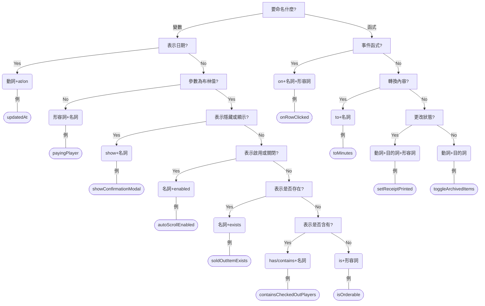

# Title 1

## Title 2

### Title 3

#### Title 4

##### Title 5

###### Title 6

First Paragraph
_Emphasis_
**Bold**
**_Emphasis Bold_**
~~Delete~~
[Link](https://example.com "Link title")
Reference-style [link][id]
Reference-style 2 [link2][]
[id]: https://example.com/ "Link title"
[link2]: https://example.com/ "Link title"

> Blockquote `inline code snippet`

```javascript
const stringToDisplay = [
  "This is a example of multi-line coding snippet",
  "You can use it to highlight your code",
];

stringToDisplay.forEach((s) => {
  console.log(s);
});
```

Second Paragraph That's one small step for man, one giant leap for mankind.

> Second Blockquote


- Unordered list item
  - Sub unordered list item
  - Sub unordered list item
    - More Sub unordered list item
- Unordered list item
- Unordered list item

1. Ordered list item 1
2. Ordered list item 2
3. Ordered list item 3

- [ ] Todo 1
- [x] Todo 2
  - [ ] Todo 2-1
  - [ ] Todo 2-2
- [ ] Todo 3

| Table Header | Second Header | Third Header |
| :----------- | :-----------: | -----------: |
| Table Cell   |    Cell 2     |       Cell 3 |
| Left align   | Center Align  |  Right align |

## Useful source

- [HTML character entities](https://en.wikipedia.org/wiki/List_of_XML_and_HTML_character_entity_references#Character_entity_references_in_HTML)
- [gihyo.jp 編集部における Markdown 記法](https://gihyo.jp/article/2022/08/gihyojp-markdown)

&copy; &reg; &para; &micro; &times; &divide; &deg; &plusmn; ＆nbsp;

---

> [Website](https://www.example.com) &nbsp;&middot;&nbsp;
> GitHub [@GitHub](https://github.com/GitHub) &nbsp;&middot;&nbsp;
> Other [Profilename](https://othersocialmedia.com/Profile)

---


Lorem ipsum dolor sit amet, consectetur adipiscing elit, sed do eiusmod tempor incididunt ut labore et dolore magna aliqua. Ut enim ad minim veniam, quis nostrud exercitation ullamco laboris nisi ut aliquip ex ea commodo consequat. Duis aute irure dolor in reprehenderit in voluptate velit esse cillum dolore eu fugiat nulla pariatur. Excepteur sint occaecat cupidatat non proident, sunt in culpa qui officia deserunt mollit anim id est laborum.

<div style="clear: both;" />


Lorem ipsum dolor sit amet, consectetur adipiscing elit, sed do eiusmod tempor incididunt ut labore et dolore magna aliqua. Ut enim ad minim veniam, quis nostrud exercitation ullamco laboris nisi ut aliquip ex ea commodo consequat. Duis aute irure dolor in reprehenderit in voluptate velit esse cillum dolore eu fugiat nulla pariatur. Excepteur sint occaecat cupidatat non proident, sunt in culpa qui officia deserunt mollit anim id est laborum.

<div style="clear: both;" />

<details>

<summary>Details element summary</summary>

details element description

</details>

## Mermaid Cheatsheet

### Flowchart

- https://mermaid-js.github.io/mermaid/
- `flowchart [directions]`
  - or `graph [directions]`？
  - `TB`: top to bottom
  - `TD`: top-down / same as top to bottom
  - `BT`: bottom to top
  - `RL`: right to left
  - `LR`: left to right
- `node`
- `node[node with text]`
- `node1 --> node2`
- `node1 -- link with text -- node2`
  - or `node1-->|text|node2`
- `node1 --> node2 & node3 --> node4`
- Node shapes:
  - round edges: `node(text)`
  - stadium-shaped: `node([text])`
  - subroutine: `node[[text]]`
  - cylindrical shape: `node[(text)]`
  - circle: `node((text))`
  - asymmetric shape: `node>text]`
  - rhombus: `node{text}`
  - hexagon: `node{{text}}`
  - parallelogram: `node[/text/]`
  - parallelogram alt: `node[\text\]`
  - trapezoid: `node[/text\]`
  - trapezoid alt: `node[\text/]`
  - double circle: `node(((text)))`
- Link shapes:
  - normal: `---`
  - normal with arrow: `-->`
  - thick: `===`
  - thick with arrow: `==>`
  - dotted: `-.-`
  - dotted with arrow: `-.->`
- subgraph
  - `subgraph [name]`
  - `direction [directions]`
  - `end`



## Other Flowchart library

- [asciiflow](https://dot-to-ascii.ggerganov.com/)
- [markmap](https://markmap.js.org/repl)

## PlantUML

- [ER 図の作図について、 Draw.io, PlantUML, Mermaid を比較してみる。（VSCode 拡張機能など）](https://qiita.com/ryamate/items/3779418172c4f5a83212)

## 縦書き

- [html と css で縦書き](https://memorocchi.net/hpcss-tategaki/)
- [縦書き HTML における文字の向きはどのように定まるか](https://blog.nnn.dev/entry/2022/07/01/180000)
- [CSS の縦書きレイアウト](https://web.havincoffee.com/css/css3/css3_a_verticalwriting.html)
- 會隨著 viewport 自動調整行高？

<div class="vertical-writing">

## [為了做「該做的事」所需要的「精氣」之枯竭](http://hatarakutokoganai.blog.fc2.com/blog-entry-561.html)

看著那些因為考試結果而「我的人生開始了！」、「人生完蛋了」地喜憂參半的考生們，令我感服他們的「精氣」。「人生」，正是徹底集中於「現在」才會出現的詞彙。伴隨而來的結果，就是巨大的希望與絕望。不論是小孩、考生、待業學生或社會人士，都是這般將視點放在「現在」，催生出行動的「精氣」。

人們常說「要思考將來」。這簡單來說，就是要用貼合願望的概念／不安去鞭策自己，並去做「該做的事」、做出行動。並且不是「肚子餓了所以去撿果實來吃」的這種該做的事，而是要達成培養學歷或職涯，或是積蓄的這種「該做的事」，我們有必要日日累積努力，並為了能持續下去，要思考「將來」。重要的是帶出「現在」做出行動的「精氣」，而不是真的要注視將來。

世上既有常保「精氣」，持續行動的人，也有還是小學生的時候就已用盡「精氣」的人。像我則是在求職期間的時候。我在那時候「看見了未來」。不是像「反正我就是不行」、「這就是我的極限了」之類的。和這種感覺是完全不同次元的感覺，同樣是「看見將來的人」就能很快理解，但不是的人就會只覺得在鬧彆扭或講歪理，的感覺。過往與他人共享的「將來」或「問題」失去了重要性，像是整個世界被翻轉了的感覺……。

例如說，努力求職卻不幸被分配到不適合的職場，就得再提出異動意願、努力改變自己融入環境，或是思考轉職，也就是得再自己做出行動。如果說被「這種狀況」打倒，也是會被罵「別天真了！」、「你只是在逃避人生而已！」吧。只會被認為是在提著不努力的藉口胡鬧。可是我非常認真地想。這些降臨的困難不是什麼自然災害之類的，而是人際關係契不契合，甚至是運氣好壞，明明只是從人際環境、系統裡產生的困難，就不禁會想「為什麼我要為了這種事而努力？那我得努力到什麼時候？」。而「到什麼時候？」的答案，就是「到死為止」、「永遠」。

社會的設定、道德、智力外貌性格等等能力疾病或障礙、週邊的人……在自己無能為力的地方擅自持續產生的坑洞，要自己努力不停填平。不管是創業、獨立或投資或人事異動或轉職或改變自己，人們提案的「解決方案」全是毫無希望、麻煩的東西。「麻煩死了」或是「我做不到」並不是對這些事情的感覺，而是得要不斷埋平莫名出現的滿坑滿谷，這種背反邏輯、毫無道理、虛脫感、閉塞感。受不了這種情境、構造，受不了這是人為的，受不了看不清這要持續到哪裡。在覺得空間上與時間上都已經被困在蟻穴裡動彈不得的瞬間，「精氣」就會急速喪失。不是「我討厭努力得不到回報！」，而是「我得努力並得到回報後到什麼時候？就算我努力並得到回報努力並得到回報努力並得到回報……回報？」的徒勞感。

「看見將來」的契機，大概會是掉進裂縫的時候吧。像是在學校被欺負而變成繭居族，普通來說會往「覺得害怕他人、無法相信」思考，但也會有些人在這時「看見」。「拿出勇氣、努力、改變自己、解決問題了，所以？還會有幾次？」考試失敗、求職失敗、工作失敗、戀愛或家庭的失敗，或是跨越困難後放下重擔……離開了學校／學習／考試／學生生活／勞動／職涯／家庭這些社會生活的「巨大洪流」後，在無意間「看見」。

我在求職時真心地覺得說著「學生時代時努力的事」的自己很噁心，這時比起「跨越難關吧！」我已經先「看見」了。跨越了，所以？之後呢？不是「我不想當社畜！」也不是「我不要充滿謊言的"成長"！」，就只是想著，我得做「這種事（填坑作業）」到什麼時候？咦？一旦對於「現在」的集中斷了線，「精氣」就會像洩氣般流失，一去不復返。如果還想在社會裡走下去，就只能用藥糊弄過去。

淡漠、什麼精神官能症、各種障礙、非精神病性的繭居族、新型憂鬱症……社會總踩著「是你（無法適應者）的錯，是你很異常」的立場，對於我寫的這些內容，也會覺得非常悲慘吧（實際上在社會裡確實是悲慘的），但心理上（如果沒有旁人的說教或生活上的困頓）是比「以前」更加舒適，也不會再對將來感到不安。當然這不是克服了不安，只是連不安都被虛無吞噬了。在壓倒性的背反邏輯面前，「將來」或「問題」已失去了一切重要性。只剩下「夠了，我不做了」。不會有「我要活在當下！做我想做的事！」這種積極性，在「看見」之後，能做的只有認命。

「啊」、「咦？」、「啥？」地回過神來、有了這種壓倒性的實際感受後，不論是進行埋洞作業的「精氣」，或是以自我肯定感（為了要（為了要（為了埋平坑洞的作業）而埋平坑洞的作業）而…）激勵自己「精氣」，都枯竭了。想要努力，身與心也提不出力。但也只是不再會有做「該做的事」需要的「精氣」，對於享受喜歡的事不會造成任何問題，「要理解那個就要先學這個」地累積也不會有什麼問題。簡單來說，活下去這件事不會有任何問題。所以說實話，我認為只是至今非法佔據著優先順位最上面的「該做的事＝填坑作業」，回到了原本的地方（地獄）去而已。

</div>

「看見將來」的契機，大概會是掉進裂縫的時候吧。像是在學校被欺負而變成繭居族，普通來說會往「覺得害怕他人、無法相信」思考，但也會有些人在這時「看見」。「拿出勇氣、努力、改變自己、解決問題了，所以？還會有幾次？」考試失敗、求職失敗、工作失敗、戀愛或家庭的失敗，或是跨越困難後放下重擔……離開了學校／學習／考試／學生生活／勞動／職涯／家庭這些社會生活的「巨大洪流」後，在無意間「看見」。

我在求職時真心地覺得說著「學生時代時努力的事」的自己很噁心，這時比起「跨越難關吧！」我已經先「看見」了。跨越了，所以？之後呢？不是「我不想當社畜！」也不是「我不要充滿謊言的"成長"！」，就只是想著，我得做「這種事（填坑作業）」到什麼時候？咦？一旦對於「現在」的集中斷了線，「精氣」就會像洩氣般流失，一去不復返。如果還想在社會裡走下去，就只能用藥糊弄過去。

淡漠、什麼精神官能症、各種障礙、非精神病性的繭居族、新型憂鬱症……社會總踩著「是你（無法適應者）的錯，是你很異常」的立場，對於我寫的這些內容，也會覺得非常悲慘吧（實際上在社會裡確實是悲慘的），但心理上（如果沒有旁人的說教或生活上的困頓）是比「以前」更加舒適，也不會再對將來感到不安。當然這不是克服了不安，只是連不安都被虛無吞噬了。在壓倒性的背反邏輯面前，「將來」或「問題」已失去了一切重要性。只剩下「夠了，我不做了」。不會有「我要活在當下！做我想做的事！」這種積極性，在「看見」之後，能做的只有認命。

「啊」、「咦？」、「啥？」地回過神來、有了這種壓倒性的實際感受後，不論是進行埋洞作業的「精氣」，或是以自我肯定感（為了要（為了要（為了埋平坑洞的作業）而埋平坑洞的作業）而…）激勵自己「精氣」，都枯竭了。想要努力，身與心也提不出力。但也只是不再會有做「該做的事」需要的「精氣」，對於享受喜歡的事不會造成任何問題，「要理解那個就要先學這個」地累積也不會有什麼問題。簡單來說，活下去這件事不會有任何問題。所以說實話，我認為只是至今非法佔據著優先順位最上面的「該做的事＝填坑作業」，回到了原本的地方（地獄）去而已。

<div style="position: relative; padding-left: 150px;">
<h2 style="writing-mode: vertical-rl; position: absolute; margin-left: 35px; left: 0; top: 0; font-size: 80px; font-weight: 700; color: red;">「精氣」之枯竭</h2>

「看見將來」的契機，大概會是掉進裂縫的時候吧。像是在學校被欺負而變成繭居族，普通來說會往「覺得害怕他人、無法相信」思考，但也會有些人在這時「看見」。「拿出勇氣、努力、改變自己、解決問題了，所以？還會有幾次？」考試失敗、求職失敗、工作失敗、戀愛或家庭的失敗，或是跨越困難後放下重擔……離開了學校／學習／考試／學生生活／勞動／職涯／家庭這些社會生活的「巨大洪流」後，在無意間「看見」。

我在求職時真心地覺得說著「學生時代時努力的事」的自己很噁心，這時比起「跨越難關吧！」我已經先「看見」了。跨越了，所以？之後呢？不是「我不想當社畜！」也不是「我不要充滿謊言的"成長"！」，就只是想著，我得做「這種事（填坑作業）」到什麼時候？咦？一旦對於「現在」的集中斷了線，「精氣」就會像洩氣般流失，一去不復返。如果還想在社會裡走下去，就只能用藥糊弄過去。

淡漠、什麼精神官能症、各種障礙、非精神病性的繭居族、新型憂鬱症……社會總踩著「是你（無法適應者）的錯，是你很異常」的立場，對於我寫的這些內容，也會覺得非常悲慘吧（實際上在社會裡確實是悲慘的），但心理上（如果沒有旁人的說教或生活上的困頓）是比「以前」更加舒適，也不會再對將來感到不安。當然這不是克服了不安，只是連不安都被虛無吞噬了。在壓倒性的背反邏輯面前，「將來」或「問題」已失去了一切重要性。只剩下「夠了，我不做了」。不會有「我要活在當下！做我想做的事！」這種積極性，在「看見」之後，能做的只有認命。

「啊」、「咦？」、「啥？」地回過神來、有了這種壓倒性的實際感受後，不論是進行埋洞作業的「精氣」，或是以自我肯定感（為了要（為了要（為了埋平坑洞的作業）而埋平坑洞的作業）而…）激勵自己「精氣」，都枯竭了。想要努力，身與心也提不出力。但也只是不再會有做「該做的事」需要的「精氣」，對於享受喜歡的事不會造成任何問題，「要理解那個就要先學這個」地累積也不會有什麼問題。簡單來說，活下去這件事不會有任何問題。所以說實話，我認為只是至今非法佔據著優先順位最上面的「該做的事＝填坑作業」，回到了原本的地方（地獄）去而已。

</div>

<div style="margin-top: 1em; padding: 1em; position: relative; border: 3px solid blue; border-radius: 8px;">
  <h2 style="margin: 0; padding: 0.25em 0.5em; position: absolute; top: -1em; left: 1em; background: #e5edc8;">「精氣」之枯竭</h2>

淡漠、什麼精神官能症、各種障礙、非精神病性的繭居族、新型憂鬱症……社會總踩著「是你（無法適應者）的錯，是你很異常」的立場，對於我寫的這些內容，也會覺得非常悲慘吧（實際上在社會裡確實是悲慘的），但心理上（如果沒有旁人的說教或生活上的困頓）是比「以前」更加舒適，也不會再對將來感到不安。當然這不是克服了不安，只是連不安都被虛無吞噬了。在壓倒性的背反邏輯面前，「將來」或「問題」已失去了一切重要性。只剩下「夠了，我不做了」。不會有「我要活在當下！做我想做的事！」這種積極性，在「看見」之後，能做的只有認命。

「啊」、「咦？」、「啥？」地回過神來、有了這種壓倒性的實際感受後，不論是進行埋洞作業的「精氣」，或是以自我肯定感（為了要（為了要（為了埋平坑洞的作業）而埋平坑洞的作業）而…）激勵自己「精氣」，都枯竭了。想要努力，身與心也提不出力。但也只是不再會有做「該做的事」需要的「精氣」，對於享受喜歡的事不會造成任何問題，「要理解那個就要先學這個」地累積也不會有什麼問題。簡單來說，活下去這件事不會有任何問題。所以說實話，我認為只是至今非法佔據著優先順位最上面的「該做的事＝填坑作業」，回到了原本的地方（地獄）去而已。

</div>

<div style="margin: .5em auto; width: fit-content; transform: skewX(-10deg); font-size: 2em; color: white; background: black;">TITLE</div>

<div style="display: inline-block; padding: 5px 10px 2px; border-radius: 4px 4px 0 0; background-color: #ea4747; color: #fff;">
<span>❒ Title</span>
</div>
<div style="padding: 20px; margin: 0 auto 20px; font-size: 18px; border: 2px solid #ea4747; border-radius: 0 4px 4px 4px; background: rgba(255, 254, 242, 0.5);">
<span>Paragraph</span>
</div>

<div style="padding: .125em; width: 24em; display: flex; align-items: center; color: #efefef; background-color: #2f2f2f;">
  <div style="margin-left: .25em; margin-right: .5em; display: inline-block; border: 1px solid #efefef;">
    <span style="display: inline-block; padding: 0 .125em; color: #2f2f2f; background-color: #efefef;">BP</span>
    <span style="display: inline-block; padding-right: .125em;">05</span>
  </div>
  <span>勇の心は開くのか（８話）</span>
</div>
<div style="padding: .125em; margin-top: .5em; width: 24em; display: flex; align-items: center; color: #efefef; background-color: #2f2f2f;">
  <div style="margin-left: .25em; margin-right: .5em; display: inline-block; border: 1px solid #efefef;">
    <span style="display: inline-block; padding: 0 .125em; color: #2f2f2f; background-color: #efefef;">BP</span>
    <span style="display: inline-block; padding-right: .125em;">06</span>
  </div>
  <span>ブレンのもとで語り合う勇と比瑪（８話）</span>
</div>

<span></span><span style="display: inline-block; transform: rotate(45deg); transform-origin: center center;"></span><span></span><span></span>

<!-- https://bindup.jp/camp/bind/howto/31221 -->
<div style="margin-top: 1em; padding: 4em; background-image: linear-gradient(110deg,transparent 20%,#e5ebf0 20%)" />
<div style="margin-left: .5em; width: 48%; float: left;">
  <h2 style="margin-top: -4em; margin-left: 1em;">TITLE</h2>
  
  <p>Lorem lorem lorem lorem lorem lorem</p>
</div>
<div style="margin-left: .5em; width: 48%; float: left;">
  <p style="margin-left: 5em; margin-top: 1em;">Lorem lorem lorem lorem lorem lorem</p>
  
  <h4 style="text-align: right;">SUBTITLE</h4>
</div>
<div style="clear: both;" />

<div style="font-size: 4em; height: .5em; overflow: hidden; color: var(--subtitle-color);">TEXT</div>
<div style="font-size: 4em; height: .5em; overflow: hidden; color: var(--subtext-color);">TEXT</div>
<div style="font-size: 4em; height: .5em; overflow: hidden; color: var(--title-color);">TEXT</div>
<div style="font-size: 4em;">TEXT</div>
<div style="font-size: 4em; color: #e5edc8;
  text-shadow: -1px 1px 0 var(--subtitle-color), 1px 1px 0 var(--subtitle-color), 1px -1px 0 var(--subtitle-color), -1px -1px 0 var(--subtitle-color);">
  TEXT
</div>

<span style="padding-left: 2px; color: yellow; background-color: red; border-bottom: 1px solid red;">TEXT</span><span style="background-color: red; clip-path: polygon(0 0, 100% 100%, 0 100%); border-bottom: 1px solid red;">&nbsp;</span><span style="display: inline-block; margin-left: -2px; width: 8em; border-bottom: 1px solid red;">TEXT</span>

🟥🟧🟨🟩🟦🟫🟪⬛⬜

```
🟥🟥
⬛🟥🟥

🟧
🟧
🟧🟧

🟨🟨
🟨🟨

⬛🟩🟩
🟩🟩

🟦
🟦
🟦
🟦

⬛🟫
⬛🟫
🟫🟫

⬛🟪
🟪🟪🟪
```

<div style="display: flex; align-items: center; gap: 8px;">
  <div style="flex-grow: 1;">
    <CircleBorder text="</>" />
  </div>
  <div style="flex-grow: 1;">
    <BalloonQuote quote="淡漠、什麼精神官能症、各種障礙、非精神病性的繭居族、新型憂鬱症……社會總踩著「是你（無法適應者）的錯，是你很異常」的立場，對於我寫的這些內容，也會覺得非常悲慘吧（實際上在社會裡確實是悲慘的），但心理上（如果沒有旁人的說教或生活上的困頓）是比「以前」更加舒適，也不會再對將來感到不安。當然這不是克服了不安，只是連不安都被虛無吞噬了。在壓倒性的背反邏輯面前，「將來」或「問題」已失去了一切重要性。只剩下「夠了，我不做了」。不會有「我要活在當下！做我想做的事！」這種積極性，在「看見」之後，能做的只有認命。" />
  </div>
</div>

<div style="margin-top: 16px; display: flex; align-items: center; gap: 8px;">
  <div style="flex-grow: 1;">
    <BalloonQuote right quote="「啊」、「咦？」、「啥？」地回過神來、有了這種壓倒性的實際感受後，不論是進行埋洞作業的「精氣」，或是以自我肯定感（為了要（為了要（為了埋平坑洞的作業）而埋平坑洞的作業）而…）激勵自己「精氣」，都枯竭了。想要努力，身與心也提不出力。但也只是不再會有做「該做的事」需要的「精氣」，對於享受喜歡的事不會造成任何問題，「要理解那個就要先學這個」地累積也不會有什麼問題。簡單來說，活下去這件事不會有任何問題。所以說實話，我認為只是至今非法佔據著優先順位最上面的「該做的事＝填坑作業」，回到了原本的地方（地獄）去而已。" />
  </div>
  <div style="flex-grow: 1;">
    <CircleBorder image="https://i.imgur.com/qXRNc2f.png" borderColor="maroon" />
  </div>
</div>

<div style="margin: 16px auto 0; padding: 2em; width: fit-content; border-radius: 90% 5% 90% 5% / 10% 90% 10% 90%; background: white;">
  text
</div>

<div style="margin-top: 16px;">
  <span style="color: #ff4b00;">#ff4b00</span>
  <span style="color: #f6aa00;">#f6aa00</span>
  <span style="color: #f2e700;">#f2e700</span>
  <span style="color: #00b06b;">#00b06b</span>
  <span style="color: #1971ff;">#1971ff</span>
  <span style="color: #990099;">#990099</span>
</div>

<div style="margin-top: 16px;">
  <div>
    <span style="color: #ff0000;">R #ff0000</span>
    <span style="color: #00ff00;">G #00ff00</span>
    <span style="color: #0000ff;">B #0000ff</span>
  </div>
  <div>
    <span style="color: #00ffff;">C #00ffff</span>
    <span style="color: #ff00ff;">M #ff00ff</span>
    <span style="color: #ffff00;">Y #ffff00</span>
  </div>
  <div>
    <span style="color: #ffffff;">W #ffffff</span>
    <span style="color: #000000;">B #000000</span>
    <span style="color: #808080;">G #808080</span>
  </div>
</div>

<div style="margin-top: 16px; margin-bottom: 16px;">
  <div>
    <span style="padding: 0 .25em; color: #00ff95; background: #004466;">#00ff95</span>
    <span style="padding: 0 .25em; color: #004466; background: #00ff95;">#004466</span>
  </div>
  <div style="margin-top: 8px;">
    <span style="padding: 0 .25em; color: #82fccc; background: #0c030a;">#82fccc</span>
    <span style="padding: 0 .25em; color: #bee943; background: #1d022d;">#bee943</span>
    <span style="padding: 0 .25em; color: #fad320; background: #131920;">#fad320</span>
    <span style="padding: 0 .25em; color: #cfc452; background: #0e0a0a;">#cfc452</span>
  </div>
  <div style="margin-top: 8px;">
    <span style="padding: 0 .25em; color: #7ff7e6; background: #0d0409;">#7ff7e6</span>
    <span style="padding: 0 .25em; color: #68e573; background: #371359;">#68e573</span>
    <span style="padding: 0 .25em; color: #1c68ef; background: #fdfd26;">#1c68ef</span>
  </div>
  <div style="margin-top: 8px;">
    <span style="padding: 0 .25em; background-color: #fe2728; color: white;">#fe2728</span>
    <span style="padding: 0 .25em; background-color: #6db714; color: white;">#6db714</span>
    <span style="padding: 0 .25em; background-color: #19a3c8; color: white;">#19a3c8</span>
    <span style="padding: 0 .25em; color: #eee; background-color: #2a2928;">#2a2928</span>
  </div>
</div>
<AutomaticColorText backgroundColor="#00ff95" text="text" />
<BorderedText />

```
⣠⠀⠀⠀⠀⠀⠀⠀⠀⣠⣶⣿⣿⣷⣄⣀⣤⠰
⣿⣿⣤⠀⠀⠀⠀⠀⣰⣿⣿⣿⣿⣿⣿⣿⣥⠖
⡘⣿⣿⣿⣷⣤⣀⣀⣿⣿⣿⣿⣿⣿⣿⣿
⢳⣮⣿⣿⣿⣿⣿⣿⣿⣿⣿⣿⣿⣿⣿⣿
⠀⢿⣿⣿⣿⣿⣿⣿⣿⣿⣿⣿⣿⣿⣿⠸
⠀⠀⣶⣿⣿⣿⣿⣿⣿⣿⣿⣿⣿⣿⡟
⠀⠀⠀⠛⠿⣿⣿⣿⣿⣿⣿⣿⣿⠟
⣀⣀⣤⣶⣿⣿⣿⣿⣿⣿⣿⠿⠁
⠀⠉⠛⠿⠿⠿⠿⠟⠋⠁
```

<div style="margin: auto; width: fit-content; font-size: 50pt;" class="rainbow-gradient">𓂀</div>

> [CSS Tutorial: Create Diagonal Layouts Like It's 2020](https://9elements.com/blog/pure-css-diagonal-layouts/)

<div style="margin: calc(100% * 0.09719) auto; width: fit-content; transform: skewY(-11deg); background: white;">♦永遠(とわ)に千切れてく</div>

<!-- -135 -45 45 -->
<div style="display: flex;">
  <div style="display: grid; place-content: center; width: 18px; height: 24px; border:1px solid black; border-radius: 50% 50% 50% 50% / 60% 60% 40% 40%; transform: rotate(-135deg); background: white;"><span style="transform: rotate(135deg);">T</span></div>
  <div style="display: grid; place-content: center; margin-left: 4px; width: 18px; height: 24px; border:1px solid black; border-radius: 50% 50% 50% 50% / 60% 60% 40% 40%; transform: rotate(-45deg); background: white;"><span style="transform: rotate(45deg);">H</span></div>
  <div style="display: grid; place-content: center; margin-left: 4px; width: 18px; height: 24px; border:1px solid black; border-radius: 50% 50% 50% 50% / 60% 60% 40% 40%; transform: rotate(45deg); background: white;"><span style="transform: rotate(-45deg);">K</span></div>
</div>

<span style="writing-mode: vertical-rl;">使徒</span>、襲来

せめて、人間<span style="writing-mode: vertical-rl; vertical-align: top; text-indent: 0;">らしく</span>

- [Z̩̮̜͉̣͎͉̤͇͂̇͊̇̅̚ͅa̠͌̔l̨̢̞̘͉̟̰̱̭̜͍̙̣̬̂̿̌̐̾̾͂̍̽̓̓̇̄g̨̢̡̢̛͍̪̠̠̹̜̪̘̱͌̆̒̅̐ỏ̡̱̞̣̖̦̰̙͊́̋́̃̂̓̍̃](https://qiita.com/SekiT/items/614d5d178f717c6b2997)
- ["Zalgo"テキストコンバータ](https://jp.piliapp.com/cool-text/zalgo-text/)
- [ダイアクリティカルマークまとめ・特殊記号リスト](https://w.atwiki.jp/multilingual/pages/19.html)

<div style="margin-top: 1em; position: relative;">
  <div style="padding: 4px 1em; float: left; border-radius: 5px 0 5px 0; background: black; color: white;">
    Frame Title
  </div>
  <div style="padding: 2em 1.5em 1em; border: 3px solid black; border-radius: 5px; background: #f6f6f6;">
    Frame Content
  </div>
</div>

<div style="margin-top: 1em; border: 1px solid #333; background: #999;">
  <div style="width: 78%; height: 10px; background: #78d461;" />
</div>

<div style="margin-top: 1em; margin-bottom: 1em; border: 1px solid #333; background: #999;">
  <div style="width: 23%; height: 10px; background: #ff5623;" />
</div>

<div style="display: flex; align-items: flex-start; gap: 4px;">
  <div style="flex-grow: 1;">
    <CircleBorder size="50px" text="</>" />
  </div>
  <div style="flex-grow: 1;">
    <BalloonQuote2 quote="淡漠、什麼精神官能症、各種障礙、非精神病性的繭居族、新型憂鬱症……社會總踩著「是你（無法適應者）的錯，是你很異常」的立場，對於我寫的這些內容，也會覺得非常悲慘吧（實際上在社會裡確實是悲慘的），但心理上（如果沒有旁人的說教或生活上的困頓）是比「以前」更加舒適，也不會再對將來感到不安。當然這不是克服了不安，只是連不安都被虛無吞噬了。在壓倒性的背反邏輯面前，「將來」或「問題」已失去了一切重要性。只剩下「夠了，我不做了」。不會有「我要活在當下！做我想做的事！」這種積極性，在「看見」之後，能做的只有認命。" />
  </div>
</div>

<div style="margin-top: 16px; display: flex; align-items: flex-start; gap: 4px;">
  <div style="flex-grow: 1;">
    <BalloonQuote2 right quote="「啊」、「咦？」、「啥？」地回過神來、有了這種壓倒性的實際感受後，不論是進行埋洞作業的「精氣」，或是以自我肯定感（為了要（為了要（為了埋平坑洞的作業）而埋平坑洞的作業）而…）激勵自己「精氣」，都枯竭了。想要努力，身與心也提不出力。但也只是不再會有做「該做的事」需要的「精氣」，對於享受喜歡的事不會造成任何問題，「要理解那個就要先學這個」地累積也不會有什麼問題。簡單來說，活下去這件事不會有任何問題。所以說實話，我認為只是至今非法佔據著優先順位最上面的「該做的事＝填坑作業」，回到了原本的地方（地獄）去而已。" />
  </div>
  <div style="flex-grow: 1;">
    <CircleBorder size="50px" image="https://i.imgur.com/qXRNc2f.png" borderColor="maroon" />
  </div>
</div>

<div style="position: relative; min-height: 480px; background: url('https://i.imgur.com/XHOlLwQ.png'); background-size: cover; background-repeat: no-repeat; overflow: hidden;">
  <div style="position: absolute; width: 100%; min-height: 150%; left: -40%; top: -7%; background: white; transform: rotate(-20deg);">
  </div>
</div>

<div class="hi"></div>

<div class="explosion"></div>

<p style="transform: scale(.8, 1); transform-origin: top left; width: 125%; line-height: 2;">
  淡漠、什麼精神官能症、各種障礙、非精神病性的繭居族、新型憂鬱症……社會總踩著「是你（無法適應者）的錯，是你很異常」的立場，對於我寫的這些內容，也會覺得非常悲慘吧（實際上在社會裡確實是悲慘的），但心理上（如果沒有旁人的說教或生活上的困頓）是比「以前」更加舒適，也不會再對將來感到不安。當然這不是克服了不安，只是連不安都被虛無吞噬了。在壓倒性的背反邏輯面前，「將來」或「問題」已失去了一切重要性。只剩下「夠了，我不做了」。不會有「我要活在當下！做我想做的事！」這種積極性，在「看見」之後，能做的只有認命。
</p>

<!-- https://fujikoblog0309.com/css-gold-gradation-text -->

<span style="background-image: linear-gradient(0deg, #b8751e 0%, #ffce08 37%, #fefeb2 47%, #fafad6 50%, #fefeb2 53%, #e1ce08 63%, #b8751e 100%);
  -webkit-background-clip: text;
  color: transparent;
  font-size: 32px;">Golden</span>
<span style="background: repeating-linear-gradient(0deg, #B67B03 0.1em, #DAAF08 0.2em, #FEE9A0 0.3em, #DAAF08 0.4em, #B67B03 0.5em);
  -webkit-background-clip: text;
  color: transparent;
  font-size: 32px;">Golden</span>
<span style="background-image: linear-gradient(135deg, #b8751e 0%, #ffce08 37%, #fefeb2 47%, #fafad6 50%, #fefeb2 53%, #e1ce08 63%, #b8751e 100%);
  -webkit-background-clip: text;
  color: transparent;
  font-size: 32px">Golden</span>

<div class="sliding-background-text">
  ごめん⏎⏎⏎さよなら
</div>

<div style="margin: auto; padding-left: 2px; width: fit-content; background-image: linear-gradient(transparent 0%, rgba(10, 16, 10, 0.5) 50%); background-size: 1000px 2px; -webkit-background-clip: text; color: transparent; font-size: 2em;
  text-shadow: 0 0 10px rgba(175, 175, 175, 0.5), 0 0 5px rgba(240, 240, 240, 0.5);">
  {#each randomNum as num, i}
    {#if i !== randomNum.length -1}
      {num}<br />
    {:else}
      {num}
    {/if}
  {/each}
</div>

<div style="position: relative; text-align: center;">
  {#each [1, 2, 3, 4] as index}
  <button style="position: relative; padding: 0; outline: none; border: none; background-color: transparent; cursor: pointer;">
    <span class="skew-button-text">
      Title {index}
    </span>
  </button>
  {/each}
</div>

■[Steam API all games](https://stackoverflow.com/questions/46330864/steam-api-all-games)

<span class="sliver-glitter">███████████</span>

<span class="gold-glitter">███████████</span>

<!-- https://copypet.jp/2206/ -->

<span style="padding: 4px 16px; font-size: 1.3em; background-color: transparent; background-image: repeating-linear-gradient(-45deg, white, white 2px, transparent 0, transparent 4px);">GARA HAIKEI</span>

<!-- https://125naroom.com/web/3737 -->
<div style="
  background-color: #ffe9a7;
  background-image:  linear-gradient(30deg, #ffc107 12%, transparent 12.5%, transparent 87%, #ffc107 87.5%, #ffc107), linear-gradient(150deg, #ffc107 12%, transparent 12.5%, transparent 87%, #ffc107 87.5%, #ffc107), linear-gradient(30deg, #ffc107 12%, transparent 12.5%, transparent 87%, #ffc107 87.5%, #ffc107), linear-gradient(150deg, #ffc107 12%, transparent 12.5%, transparent 87%, #ffc107 87.5%, #ffc107), linear-gradient(60deg, #ffc10777 25%, transparent 25.5%, transparent 75%, #ffc10777 75%, #ffc10777), linear-gradient(60deg, #ffc10777 25%, transparent 25.5%, transparent 75%, #ffc10777 75%, #ffc10777);
  background-size: 40px 70px;
  background-position: 0 0, 0 0, 20px 35px, 20px 35px, 0 0, 20px 35px;">
  <p style="text-align: center;">lorem</p>
</div>

<!-- https://qiita.com/xrxoxcxox/items/073d30615a1d73c089fc -->
<div style="columns: 100px 3;">
  <div class="adjusted-image-border">
    
  </div>
  <div class="adjusted-image-border">


  </div>
  <div class="adjusted-image-border">


  </div>
</div>

```cmd
netsh winsock reset
netsh int ip reset
netsh winhttp reset proxy
ipconfig /release
ipconfig /renew
ipconfig /flushdns
```

<div style="padding: 1em; max-widt 100%; background-color: #ffffee;">
<div style="margin: 4px auto; max-width: 576px;
  color: rgb(128,0,0); background-color: #f0e0d6;">
  <div>
    <span style="color: #cc1105; font-weight: bold;">無題</span>
    <span>Name</span>
    <span style="color: #117743; font-weight: bold;">名無し</span>
    <time>{new Date().toISOString().slice(2).replaceAll('-', '/').replace('T', `(${['日', '一','二','三','四','五','六'][new Date().getDay()]})`).slice(0,-5)}</time>
    <span style="text-decoration: underline;">No.{+new Date()}</span>
  </div>
  <div style="padding: 16px 40px; line-height: 1.2;">
    <div style="color: #789922;">
      > 淡漠、什麼精神官能症、各種障礙、非精神病性的繭居族、新型憂鬱症……社會總踩著「是你（無法適應者）的錯，是你很異常」的立場，對於我寫的這些內容，也會覺得非常悲慘吧（實際上在社會裡確實是悲慘的），但心理上（如果沒有旁人的說教或生活上的困頓）是比「以前」更加舒適，也不會再對將來感到不安。當然這不是克服了不安，只是連不安都被虛無吞噬了。在壓倒性的背反邏輯面前，「將來」或「問題」已失去了一切重要性。只剩下「夠了，我不做了」。不會有「我要活在當下！做我想做的事！」這種積極性，在「看見」之後，能做的只有認命。
    </div>
    「啊」、「咦？」、「啥？」地回過神來、有了這種壓倒性的實際感受後，不論是進行埋洞作業的「精氣」，或是以自我肯定感（為了要（為了要（為了埋平坑洞的作業）而埋平坑洞的作業）而…）激勵自己「精氣」，都枯竭了。想要努力，身與心也提不出力。但也只是不再會有做「該做的事」需要的「精氣」，對於享受喜歡的事不會造成任何問題，「要理解那個就要先學這個」地累積也不會有什麼問題。簡單來說，活下去這件事不會有任何問題。所以說實話，我認為只是至今非法佔據著優先順位最上面的「該做的事＝填坑作業」，回到了原本的地方（地獄）去而已。
  </div>
</div>
</div>

<!-- <dialog open>
  <p>Greetings, one and all!</p>
  <form method="dialog">
    <button>OK</button>
  </form>
</dialog> -->

<div style="padding: 10px 0; background: #000;">
  <span style="padding-left: 10px; border-left: 35px solid #d6000f; color: white;">TITLE HERE</span>
</div>

<fieldset>
    <legend>Select a maintenance drone:</legend>
    <div>
      <input type="radio" id="huey" name="drone" value="huey"
             checked>
      <label for="huey">Huey</label>
    </div>
    <div>
      <input type="radio" id="dewey" name="drone" value="dewey">
      <label for="dewey">Dewey</label>
    </div>
    <div>
      <input type="radio" id="louie" name="drone" value="louie">
      <label for="louie">Louie</label>
    </div>
</fieldset>

<dl>
  <dt>List heading 1</dt>
  <dd>List item 1</dd>
  <dt>List heading 2</dt>
  <dd>List item 2</dd>
</dl>

<figure>
  
  <figcaption>AKIHABARA STATION</figcaption>
</figure>

<script>
  import CircleBorder from "$lib/CircleBorder.svelte";
  import BalloonQuote from "$lib/BalloonQuote.svelte";
  import AutomaticColorText from "$lib/AutomaticColorText.svelte";
  import BorderedText from "$lib/BorderedText.svelte";
  import BalloonQuote2 from "$lib/BalloonQuote2.svelte";

  let range = {
    from: 1,
    to: 5,
    
    // range[Symbol.iterator]()
    [Symbol.iterator]() {
      this.current = this.from;
      return this;
    },
    next() {
      if (this.current <= this.to) {
        return { done: false, value: this.current++ };
      } else {
        return { done: true };
      }
    }
  };
  // for (let num of range) {
  //   console.log(num);
  // }

  let randomNum = [
    Math.floor(Math.random()*89999) + 10000,
    Math.floor(Math.random()*89999) + 10000,
    Math.floor(Math.random()*89999) + 10000,
    Math.floor(Math.random()*89999) + 10000,
    Math.floor(Math.random()*89999) + 10000
  ]
  // setInterval(() => {
  //   for(let i=0; i<randomNum.length; i++) {
  //     randomNum[i] = Math.floor(Math.random()*89999) + 10000;
  //   }
  // }, 80)

  function FizzBuzz() {
    for(let i=0; i<100; i++) {
      let output = '';
      if(n % 3 === 0) output += 'Fizz';
      if(n % 5 === 0) output += 'Buzz';
  
      if(output.length > 0) console.log(output);
      else console.log(i);
    }
  }

  const incrementingNum = [...Array(5).keys()];
</script>

<style scoped>
  .vertical-writing {
    margin: auto;
    padding: 2em 0;
    width: auto;
    max-width: 100%;
    height: auto;

    writing-mode: vertical-rl;
    text-orientation: upright;
    column-width: 20em;
    column-gap: 5em;
  }
  .vertical-writing p {
    padding: 0;
    padding-left: 2em;
    text-indent: 1em;
    line-height: 1.5;
  }
  .vertical-writing h2 {
    line-height: 1.33;
  }

  /* clear custom css */
  .vertical-writing h2::after {
    border: none;
  }

  .rainbow-gradient {
    background: linear-gradient(to right, #e60000, #f39800, #fff100, #009944, #0068b7, #1d2088, #920783, #e60000) 0 / 200%;
    color: transparent;
    -webkit-background-clip: text;
    animation: 2.5s background-moving linear infinite;
  }

  @keyframes background-moving {
    100% {
      background-position: 200%;
    }
  }

  .hi {
    width: 50px;
    height: 72px;
    background-image: url("http://s.cdpn.io/79/sprite-steps.png");
    
    animation: play .8s steps(10) infinite;
  }
  @keyframes play {
    from { background-position: 0px; }
    to { background-position: -500px; }
  }

  .explosion {
    width: 100px;
    height: 100px;
    background:url('http://hasgraphics.com/wp-content/uploads/2010/08/spritesheet1.png') no-repeat;

    animation: exp-x 500ms infinite steps(9), exp-y 4.5s infinite steps(9);
  }
  @keyframes exp-x {
    from {
      background-position-x: 0;
    }
    to {
      background-position-x: -900px;
    }
  }
  @keyframes exp-y {
    from {
      background-position-y: 0;
    }
    to {
      background-position-y: -900px;
    }
  }

  .sliding-background-text {
    position: relative;
    width: fit-content;
    color: transparent;
    overflow: hidden;
    animation: 0.6s sliding-text steps(1, end) forwards;
  }
  .sliding-background-text:after {
    content: "";
    position: absolute;
    bottom: 0;
    left: 0;
    width: 0;
    height: 100%;
    background: white;
    animation: 0.6s sliding-background ease forwards;
  }
  @keyframes sliding-text {
    0% {
      color: transparent;
    }
    50%, 100% {
      color: white;
    }
  }
  @keyframes sliding-background {
    0% {
      width: 0;
      left: 0;
    }
    50% {
      width: 100%;
      left: 0;
    }
    100% {
      left: 100%;
    }
  }

  .skew-button-text {
    position: relative;
    display: block;
    padding: .25em 1em;
  }
  .skew-button-text::before {
    content: '';
    position: absolute;
    left: 50%;
    top: 50%;
    transform: translate(-50%, -50%) skewX(-25deg);
    width: 100%;
    height: 100%;
    border: 1px solid black;
  }
  .skew-button-text:hover::before {
    background-color: rgba(255, 255, 255, .2);
  }

  .sliver-glitter {
    background-image: repeating-linear-gradient(75deg, #555555 0, #999999 25px, #f3f3f3 40px, #999999 65px, #555555 100px);
  }
  .gold-glitter {
    background-image: repeating-linear-gradient(75deg, #b67b03 0, #daaf08 15px, #fee9a0 30px, #daaf08 55px, #b67b03 90px, #b67b03 100px);
  }
  .sliver-glitter,
  .gold-glitter {
    background-size: 300vw 100px;
    color: transparent;
    animation: glitter 1.5s linear infinite;
  }
  @keyframes glitter {
    0% {
      background-position-x: 150vw;
      background-position-y: 50px;
    }
    100% {
      background-position-x: calc(150vw - 96.5926px);
      background-position-y: calc(50px + 25.8819px);
    }
  }
  
  .adjusted-image-border {
    position: relative;
  }
  .adjusted-image-border p {
    padding: 0;
  }
  .adjusted-image-border::before {
    position: absolute;
    content: "";
    inset: 0;
    box-shadow: 0 0 0 2px rgb(220 220 220) inset;
    mix-blend-mode: darken;
  }
</style>
